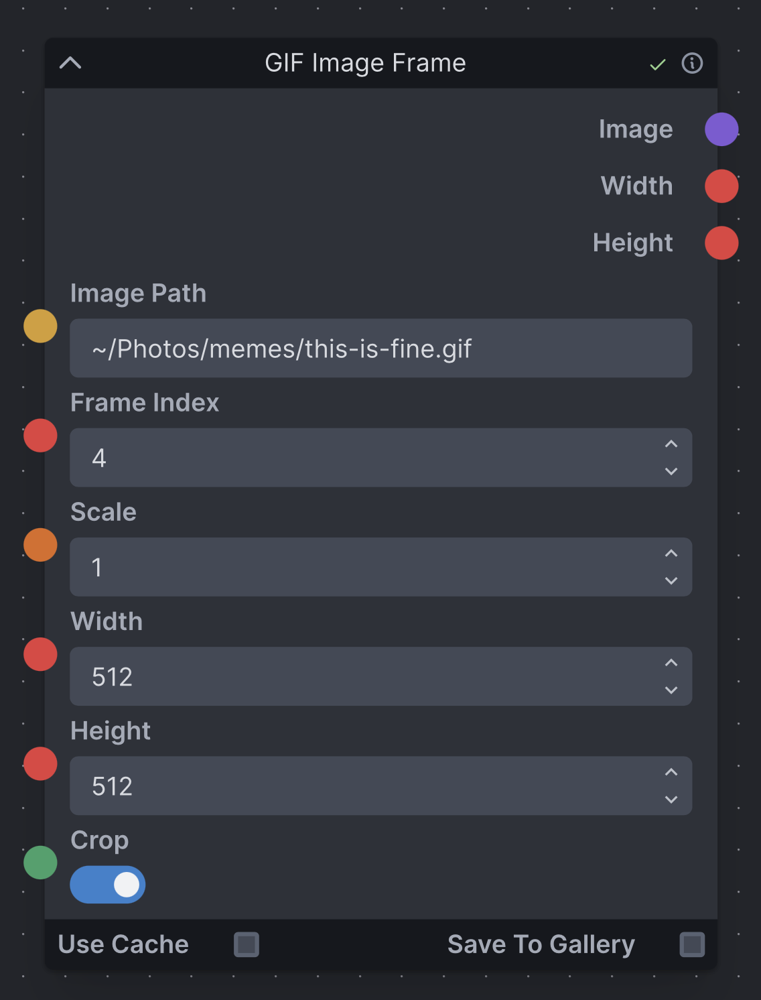

# GIF Image Frame

A simple InvokeAI node to provide a GIF (or PNG) image frame input.

- Load a GIF (or PNG) image from a given file path and frame index
- Scale the image by a uniform factor, if provided
- Scale to fit within a given width and height, if provided
- Option to crop or pad the resized image (with transparency)



### Requirements

- `pip install PIL`

### Installation

Navigate to your InvokeAI installation's `nodes` folder, and run
```sh
git clone https://github.com/thinkyhead/gif-image-frame
```
or, just click the green button in the upper-right, download the zip, and unzip it in your `nodes` folder.

### Future Work

- Option to increment the frame index on each invocation

### Other nodes by Thinkyhead

- [image-rotate-flip](//github.com/thinkyhead/image-rotate-flip)
